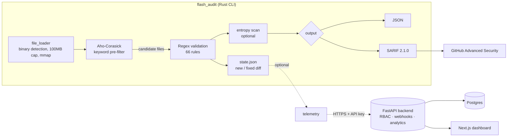

# FlashAudit

**A Rust secrets scanner that clears the 61k-file rust-lang/rust checkout in ~0.6 seconds — 4–10× faster than Gitleaks across three real corpora — so secret detection fits inside a pre-commit hook instead of a nightly job.**

[](https://github.com/Ruddxxy/Flash-Audit-Core/actions/workflows/audit.yml)
[](https://github.com/Ruddxxy/Flash-Audit-Core/actions/workflows/backend.yml)
[](LICENSE)

FlashAudit finds leaked credentials — API keys, private keys, database URLs, tokens — in source trees,
git diffs, and staged changes. It pairs an Aho-Corasick keyword pre-filter with 66 precise regex rules so
the expensive patterns only run on files that already contain a matching trigger. The result is fast enough
to run on every commit, quiet enough to keep a pre-commit gate usable (5 findings vs. Gitleaks' 32 across
the three benchmark corpora below — every one a test fixture or docs example, on both sides), and CI-ready
via SARIF output for GitHub Advanced Security.

## Demo

```console
$ flash_audit .
Scanned 500 files in 0.12s. 0 errors. 3 secrets found (2 new, 1 fixed).
[
  {
    "file": "config.env",
    "line": 12,
    "match_content": "sk_live_...[REDACTED]",
    "rule_id": "STRIPE_LIVE_KEY",
    "description": "Stripe Live Secret Key",
    "risk": { "class": "api_key", "impact": "critical" }
  }
]
$ echo $?
1        # non-zero exit => CI fails the build
```

Secrets are always redacted in output (first 12 characters + `...[REDACTED]`); the raw value never leaves the
process except as a salted SHA-256 fingerprint used for cross-scan deduplication.

## Performance

Wall-clock scan time, FlashAudit 1.1.1 vs. a regex-only baseline (Gitleaks 8.30.1, `dir` mode), measured
with `hyperfine --warmup 3 --runs 10` on shallow checkouts (16-core Linux; median ± σ):

| Repository                  | Files  | FlashAudit         | Gitleaks       | Speedup   | Findings (FA / GL) |
| --------------------------- | ------ | ------------------ | -------------- | --------- | ------------------ |
| Express (`ba00676`)         | 213    | **0.129s ± 0.002** | 0.536s ± 0.026 | 4.2×      | 0 / 0              |
| Django (`65a9f14`)          | 7,070  | **0.218s ± 0.005** | 1.811s ± 0.048 | 8.3×      | 1 / 8              |
| rust-lang/rust (`b69e089e`) | 60,942 | **0.575s ± 0.024** | 6.033s ± 0.208 | **10.5×** | 4 / 24             |

Every finding on both sides is a dummy value in a test fixture or docs example — the corpora are clean —
so the findings column doubles as a false-positive count. Raw hyperfine output is committed in
`bench-results.txt`. The speedup grows with repository size: on small trees the fixed startup cost
dominates, but on large trees the Aho-Corasick pre-filter skips the regex engine entirely for files with
no keyword hit, which is most of them. Numbers are hardware- and version-dependent — reproduce them
yourself:

```bash
# Requires: hyperfine, gitleaks >= 8.19, and a target repo checked out at ./target-repo
cargo build --release
hyperfine --warmup 3 --runs 10 -i \
  './target/release/flash_audit ./target-repo' \
  'gitleaks dir ./target-repo --no-banner'
```

## Architecture



The Rust CLI is fully self-contained and needs none of the optional components. The FastAPI backend and
Next.js dashboard exist for teams that want centralized cross-repository tracking; the CLI pushes only
redacted fingerprints and metadata to them, never raw secrets.

## Quick Start

```bash
# From source
git clone https://github.com/Ruddxxy/Flash-Audit-Core.git
cd Flash-Audit-Core
cargo build --release
./target/release/flash_audit .          # scan current directory

# Or via Cargo, straight from the release tag
cargo install --locked --git https://github.com/Ruddxxy/Flash-Audit-Core --tag v1.1.1
```

Common invocations:

```bash
flash_audit /path/to/repo                       # JSON to stdout
flash_audit --format sarif . > results.sarif    # SARIF for GitHub Advanced Security
flash_audit --git-diff main .                   # only files changed since main
flash_audit --staged .                          # only staged files (pre-commit)
flash_audit --entropy .                          # add Shannon-entropy detection
flash_audit --rules my-rules.yaml .             # custom ruleset
```

### CI, pre-commit, Docker

```yaml
# GitHub Actions
- uses: Ruddxxy/Flash-Audit-Core@v1
  with:
    path: "."
    format: "sarif"
    upload-sarif: true
    fail-on-finding: true
```

```yaml
# .pre-commit-config.yaml
repos:
  - repo: https://github.com/Ruddxxy/Flash-Audit-Core
    rev: v1.1.1
    hooks:
      - id: flashaudit
```

```bash
# Docker
docker run --rm -v "$(pwd):/repo" ghcr.io/ruddxxy/flash-audit-core:latest /repo --format sarif
```

## How It Works

1. **File loading** (`src/utils/file_loader.rs`) — walks the tree respecting `.gitignore`, rejects binaries
   via 30+ magic-byte signatures plus null/control-char heuristics, caps files at 100 MB, and memory-maps
   anything over 10 MB. Invalid UTF-8 is skipped, not fatal.
2. **Pre-filter** (`src/scanner.rs`) — a single Aho-Corasick pass finds which of the 66 rule keywords appear
   in the file. Files with no keyword hit never touch the regex engine.
3. **Validation** — only the rules whose keyword matched are run as full regexes, yielding line numbers and
   redacted matches.
4. **State & telemetry** (`src/utils/state.rs`, `telemetry.rs`) — findings are fingerprinted with SHA-256 and
   diffed against the previous scan to report _new_ vs. _fixed_ secrets; optional non-blocking telemetry can
   forward this to the backend.

Rules live in `rules.yaml` (embedded into the binary at build time via `include_str!`) and can be overridden
with `--rules`. Each rule carries an `id`, a `pattern`, and `risk` metadata (`class`, `impact`).

## Testing

```bash
cargo test            # Rust engine unit tests (8)
cd backend && pytest  # backend API tests (46)
```

- **8 Rust unit tests** (`src/scanner.rs`) cover detection, correct line numbers, multi-byte-safe redaction,
  fingerprint determinism, keyword extraction, and that all 66 embedded rules compile.
- **46 backend tests** (`backend/tests/`) cover auth/RBAC, CLI ingest endpoints, findings, remediation,
  security, and health.

Both suites run in CI on every push (see the badges above).

## Reference

### CLI options

| Option                | Default  | Description                       |
| --------------------- | -------- | --------------------------------- |
| `[PATH]`              | `.`      | Directory to scan                 |
| `-f, --format`        | json     | Output format: `json` or `sarif`  |
| `--rules`             | embedded | Path to custom rules.yaml         |
| `--git-diff <REF>`    | –        | Only scan files changed since REF |
| `--staged`            | false    | Only scan staged files            |
| `--entropy`           | false    | Enable entropy scanning           |
| `--entropy-threshold` | 4.5      | Entropy threshold                 |
| `--report-to <URL>`   | –        | Telemetry endpoint                |
| `--org <ORG>`         | –        | Organization context              |
| `--repo <REPO>`       | –        | Repository context                |
| `--api-key <KEY>`     | env      | API key (`FLASHAUDIT_API_KEY`)    |
| `-v, --verbose`       | false    | Debug output                      |

### Exit codes

| Code | Meaning       |
| ---- | ------------- |
| 0    | No secrets    |
| 1    | Secrets found |
| 2    | Error         |

### Detected secrets (66 patterns)

Private keys (RSA, OpenSSH, EC, PGP, DSA, PuTTY) · AWS · GitHub (`ghp_`/`gho_`/`ghu_`/`ghs_`/`ghr_`) ·
GitLab · Slack · Google/Firebase · Stripe · Azure · DigitalOcean · Datadog · Cloudflare · OpenAI/Anthropic ·
HashiCorp Vault · database URLs (`postgres://`, `mysql://`, `mongodb://`, `redis://`) · SendGrid · Twilio ·
NPM · PyPI · Shopify · Discord · Heroku · JWT.

### Optional backend

```bash
cd backend
pip install -r requirements.txt
export ADMIN_KEY="your-secure-admin-key"
uvicorn main:app --host 0.0.0.0 --port 8000
```

| Endpoint                      | Method | Auth        | Description         |
| ----------------------------- | ------ | ----------- | ------------------- |
| `/health`                     | GET    | None        | Health check        |
| `/api/v1/state`               | GET    | X-API-Key   | Get active secrets  |
| `/api/v1/events`              | POST   | X-API-Key   | Ingest scan events  |
| `/api/v1/admin/organizations` | POST   | X-Admin-Key | Create organization |

## License

MIT — see [LICENSE](LICENSE).
